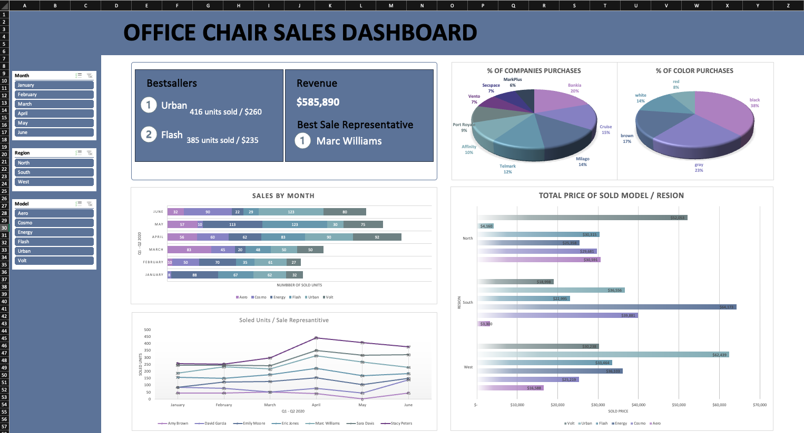

# Office-Chair-Sales-Dashboard-Excel
Coursera Project to analyze office chair sales data of Q1-Q2 2020

# Overview 
This data was a part of [Coursera Guided Project](https://www.coursera.org/projects/introduction-data-analysis-microsoft-excel) to analyze office chair sales data for Q1-Q2 2020.

The data contains 80 rows as listed below:
1. Num (ID)
2. Date
3. Month
4. Sales Representative
5.  Region
6.  Customer ID
7.  Model
8.  Color
9.  Item Code
10.  Number (# of purchases)
11.  Price / Unit
12.  Total

## New Columns
1. Company Name _using VLOOKUP formual_
2. Client Representative _using VLOOKUP formual_
3. 5% Discount _using IF formual_ **Only customers who bought >= 20 items**
4. Final Price _using IF formual_ ```Total*0.95```

## Pivot Tables
- Number of models sold per month
- Sold models (Price _after 5% discount_) per region
- Total units sales per sale representative in each month
- Percentage of purchased color
- Percentage of companies purchases
- Bestseller (Model), Best Sales representative

  # Dashboard Preview
  
